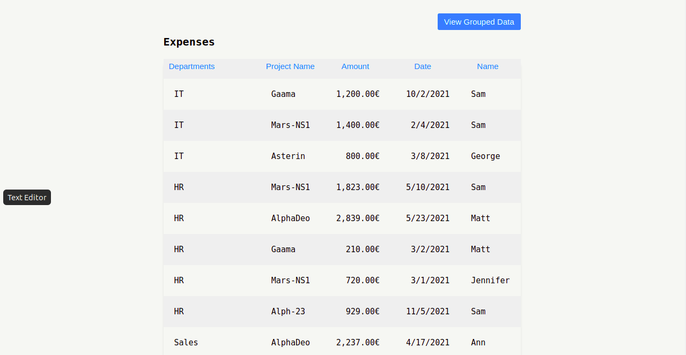
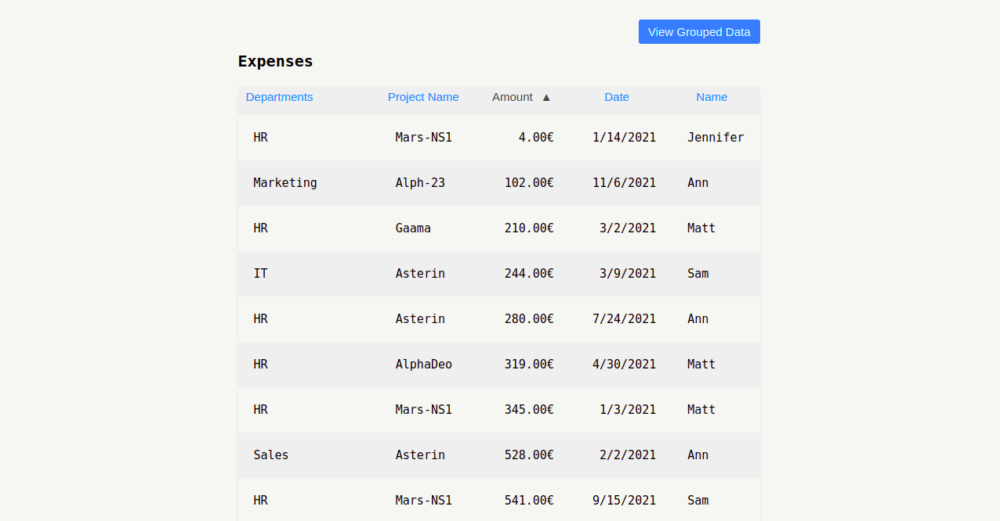
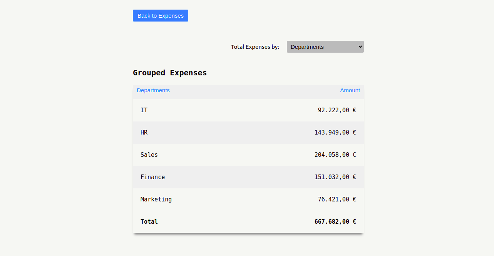

## Pectus Finance Feature - Transactions

A feature that gets user uploaded expenses, displays them in a tabular form and allows the user to sort and filter.
[Demo](https://5ezprg.csb.app/)

[On CodeSandbox](https://codesandbox.io/s/github/chidexebere/transactions)

## Features

1. Displays expenses data in tabular form.
   

2. Allows user to perform sort(asc/descending order) operation by clicking on each column header.
   

3. Group expenses data displaying total sum of expenses by departments, project name, date and member name.
   

4. Displays total sum of value in amount column.
   

## Installation

You would need to have [Node.js](https://nodejs.org/en/) and [yarn](https://yarnpkg.com/) installed.

To install dependencies, you can run:

```bash
yarn
```

## Running the project

To run the project locally, in the project directory, run:

```bash
yarn start
```

Runs the app in the development mode.<br />
Open [http://localhost:3000](http://localhost:3000) to view it in the browser.

## Testing

To run unit and integration test, in the project directory, run:

```bash
yarn test
```

To run end-to-end test, in the project directory, run:

```bash
yarn e2e
```

## Technologies used

- React and TypeScript: used to build the UI components
- Styled components and SASS: for styling
- React Query: for managing server state
- React testing library and MSW : for unit and integration tests
- Cypress : for end-to-end tests
- Eslint for linting and Prettier for code formating
